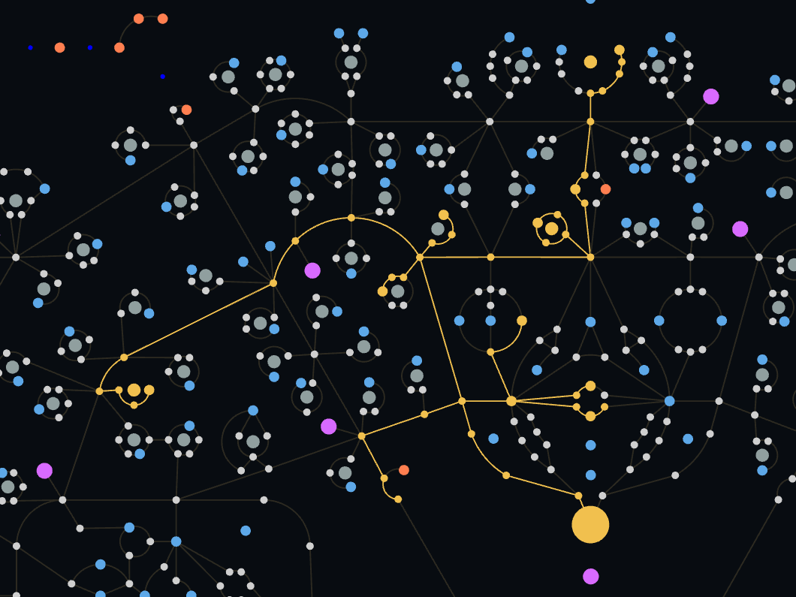

# Path of Exile's passive tree in TypeScript


A faithful, interactive recreation of the **Path of Exile passive skill tree** built as a modern web application. This is a personal deep-dive project combining complex graph data structures, high-performance WebGL rendering, and clean domain-driven architecture.

> [!NOTE]
> **Core logic is complete, visual rendering is in progress.** Graph traversal, node allocation, hover pathfinding, and the full DDD architecture are implemented and functional. The Pixi.js rendering layer (sprite assets, visual theming, animations) is actively being built on top of this foundation.



## ✨ Features

- **Domain-Driven Design (DDD) architecture** with enforced layer boundaries
- **Graph traversal & pathfinding** — shortest path, reachability, orphan detection
- **Interactive allocation** — click nodes to allocate/deallocate, with live path preview on hover
- **Class & Ascendancy selection** — filters the tree per character class starting position
- **Hover preview** — computes the shortest reachable path from current allocation in real time
- **Refund dependency tracking** — safely highlights which nodes would be orphaned on refund
- **Reactive state management** with Pinia -- optimized for high-frequency updates

See the [`ROADMAP.md`](ROADMAP.md) for planned features.

## 🛠 Tech Stack

| Concern   | Technology                 |
| --------- | -------------------------- |
| Framework | Vue 3 (Composition API)    |
| Rendering | Pixi.js v8 (WebGL)         |
| Language  | 100% TypeScript (strict)   |
| State     | Pinia                      |
| Build     | Vite + Bun                 |
| Testing   | Vitest                     |
| Linting   | ESLint + Oxlint + Prettier |

---

## Architecture

The project follows a strict **Domain-Driven Design** layer structure with enforced boundaries.

See [`docs/architecture.md`](docs/architecture.md) for the full architecture breakdown.

## Status

See the [`ROADMAP.md`](ROADMAP.md) for more details about what has been done, what needs to be done and will be done.

## Getting Started

Requires [Bun](https://bun.sh/) or Node.js `^20.19.0 || >=22.12.0`.

```bash
bun install
bun run dev

bun run test:unit   # unit tests
bun run lint        # oxlint + ESLint
bun run type-check  # vue-tsc
```

## Further Reading

- [Architecture decisions](docs/architecture.md)
- [Roadmap so far](ROADMAP.md)

## Final notes

This project is open source but does not seek contribution (it's not ready for that).
Obviously this does not replace tools like Path of Building or other PoE build planners, but it aims to be as accurate and easy to use as the in-game passive tree.

Path of Exile and all related assets are property of [Grinding Gear Games](https://www.grindinggear.com/).
